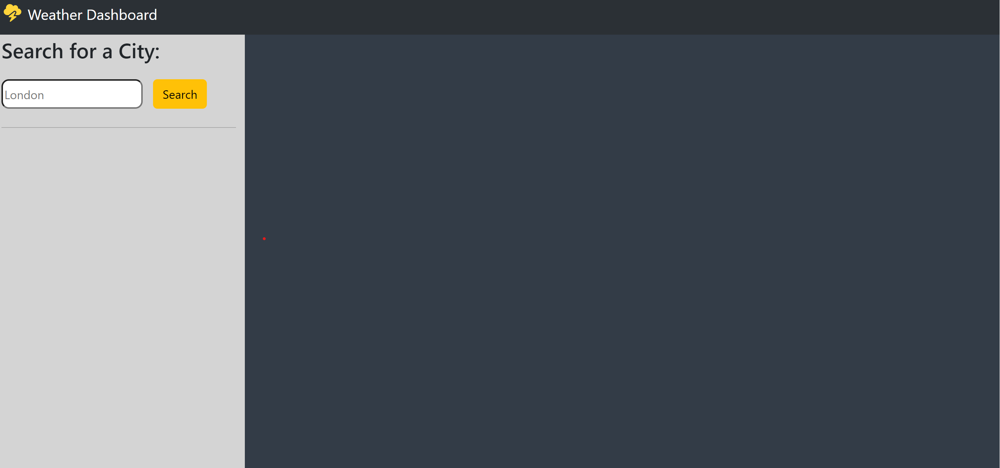
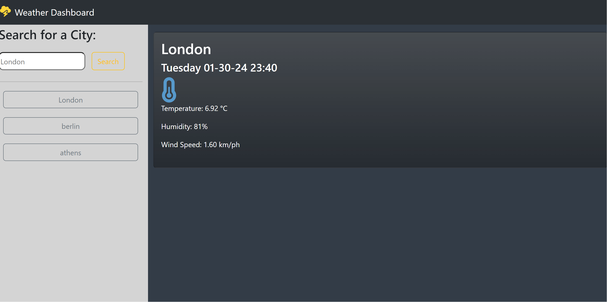

# Weather App 

See site [here]()

## Overview

This project's requirement was to create a simple weather forecast application where the user can look up the current weather in any city.

Once the user selects the search button to perform the search. Buttons with the city name will populate on the aside section and it will save in local storage the searches. User can see the serach history even after refreshing the page. 

